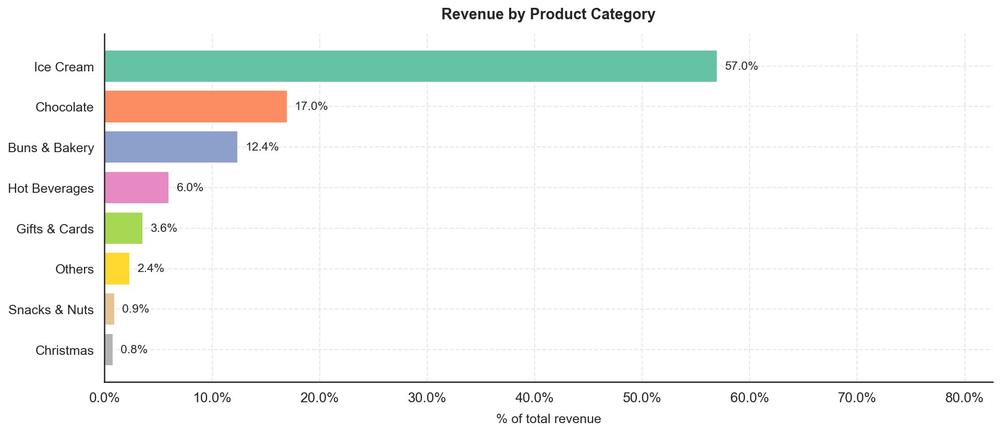
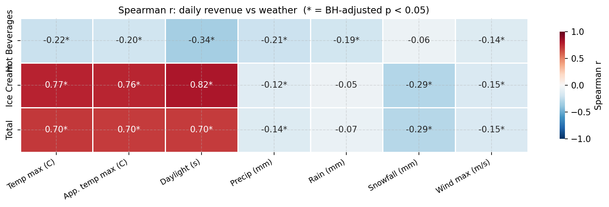

# Shopify Sales & Weather Analysis

**Sales analytics and weather-driven revenue forecasting for an anonymized Danish artisan food chain.**

A Danish artisan food chain (ice cream, chocolate, bakery, coffee) operates seven physical stores and runs its point-of-sale on Shopify. This project analyses approximately 454,000 transaction lines across a 14-month period (January 2024–March 2025) with two goals: understand what drives revenue across products, categories, stores, and seasons; and build a weather-driven short-horizon forecast of daily ice-cream revenue to support staffing, preparation, and inventory decisions. All client identifiers have been removed — stores are labelled A–G and revenue is expressed as percentages or indices throughout.

---

## Headline Results

| Finding | Detail |
|---|---|
| Revenue concentration | ~20 products = **80% of revenue** (clean Pareto) |
| Category dominance | **Ice Cream ~57%** of total revenue; Chocolate #2, Buns & Bakery #3 |
| Seasonality | Peak **May–June**; busiest days **Fri/Sat** (+109–122% vs Monday); peak window **14:00–16:00** |
| Weather effect | **+1 °C → +5.7% Ice Cream revenue** (95% CI: +4.4% to +7.1%); **+1 h daylight → +11.2%** (+4.6% to +18.2%) |
| Data quality | One store's POS terminal unsynced to Shopify SKUs — concentrated block of unattributed transactions, declining after reconfiguration |
| Forecast accuracy | XGBoost **WAPE 39.5%** vs seasonal-naive baseline **47.2%** (5-fold time-series CV) |
| Prediction intervals | CQR-calibrated 90% intervals reach **~81% empirical coverage** |

---

## Figures

<p align="center">
  
  
</p>

*Left: Revenue share by product category. Right: Spearman correlations between weather variables and daily revenue by category, with bootstrap confidence intervals.*

Additional figures — seasonality breakdowns, store comparisons, OLS coefficient forest plot, XGBoost SHAP summary, cross-validation metrics, conformal prediction interval coverage — are in [`figures/`](figures/).

---

## Methodology

### Block A — Descriptive Sales Analysis
- Pareto (80/20) product concentration by revenue and units
- Revenue by category, store, month, weekday, and hour-of-day
- Store comparison: category mix, local champions, footfall patterns

### Block B — Data-Quality Investigation
- Identified and quantified a POS-to-Shopify sync failure concentrated in one store
- Tracked the unknown-product rate by store and over time; confirmed partial resolution after a POS reconfiguration event

### Block C — Weather Statistics
- Daily weather pulled from the Open-Meteo archive API (temperature, precipitation, wind speed, daylight duration)
- Spearman and Pearson correlations with block-bootstrap 95% confidence intervals
- Group comparisons (warm/cold, rainy/dry, long/short daylight, summer/winter) using Mann-Whitney U with rank-biserial effect sizes and BH-FDR multiple-testing correction
- Multicollinearity handled explicitly: VIF analysis; feels-like temperature excluded from regression

### Block D — Predictive Modelling
| Component | Detail |
|---|---|
| Interpretable model | OLS on log(revenue + 1); HC3 robust SEs; coefficients exponentiated to % effects; BH-FDR correction across all 27 predictors |
| Forecaster | XGBoost with autoregressive lag features (lag-1, lag-7, 7-day rolling mean) and cyclical calendar encodings |
| Validation | `TimeSeriesSplit` (5 folds), date-keyed so all stores share the same fold assignment — no leakage |
| Baseline | Seasonal-naive (lag-7) WAPE reported alongside model WAPE every fold |
| Uncertainty | Conformalized Quantile Regression (CQR) calibration; per-fold q-hat adjustment; empirical coverage reported |
| Explainability | SHAP tree explainer on the full dataset; mean absolute SHAP values ranked by feature |

---

## Full Report

The complete write-up — methodology, all figures, tables, and findings — is available in two formats:

- [📄 Full report (PDF)](report.pdf)
- [📝 Editable DOCX](report.docx)

---

## Repository Structure

```
.
├── src/                    # Analysis modules
│   ├── data_loading.py     #   Shopify export ingestion
│   ├── cleaning.py         #   Filtering, normalization, revenue derivation
│   ├── categorization.py   #   Product family mapping
│   ├── anonymize.py        #   Store-name → label-A-G substitution
│   ├── eda.py              #   Descriptive analysis & visualizations
│   ├── data_quality.py     #   Unknown-product investigation
│   ├── weather.py          #   Open-Meteo API fetch & daily panel assembly
│   ├── weather_stats.py    #   Inferential weather statistics
│   ├── modeling.py         #   OLS, XGBoost, CQR, SHAP
│   └── config.py           #   Paths and constants
│
├── tests/                  # pytest unit & integration tests (216 passing)
├── notebooks/              # Exploratory scripts and EDA notebook
├── figures/                # All 23 publication-ready PNG figures
├── reports/
│   ├── report.pdf          #   Final deliverable
│   └── report.docx         #   Editable source
├── scripts/                # Report-assembly automation (docx builders)
└── requirements.txt
```

---

## Setup & Reproducibility

```bash
git clone https://github.com/Carlynn16/shopify-sales-weather-analysis.git
cd shopify-sales-weather-analysis
python -m venv venv
source venv/bin/activate        # Windows: venv\Scripts\activate
pip install -r requirements.txt
```

> **Raw data not included.** The original Shopify export contains client-confidential figures and customer PII and is excluded from this repository. All source code, tests, figures, and the final report are provided. The pipeline can be re-run locally once the raw CSVs are placed in `data/` (see `src/config.py` for expected file names).

---

## Tech Stack

| Layer | Libraries |
|---|---|
| Data wrangling | `pandas`, `numpy` |
| Statistics | `scipy`, `statsmodels` |
| Machine learning | `scikit-learn`, `xgboost`, `shap` |
| Visualisation | `matplotlib`, `seaborn` |
| Weather API | `requests` (Open-Meteo archive) |
| Report generation | `python-docx`, `docx2pdf` |
| Testing | `pytest` |

---

## Tests

```
pytest tests/
# 216 passed
```

Eight test modules cover data loading, cleaning, categorization, EDA helpers, data-quality metrics, weather fetch and statistics, and the full modelling pipeline (OLS coefficients, XGBoost CV, CQR calibration, SHAP shapes).

---

## Data & Confidentiality

- The raw Shopify export is **not committed** to this repository (git-ignored under `data/`).
- The client name and store locations have been removed from all code, figures, and the report.
- Stores are labelled **A–G**; all revenue figures are expressed as **percentages or indices** — no absolute monetary values appear anywhere in the public repository.
- Weather data is sourced from the public [Open-Meteo](https://open-meteo.com/) archive API and contains no client information.
